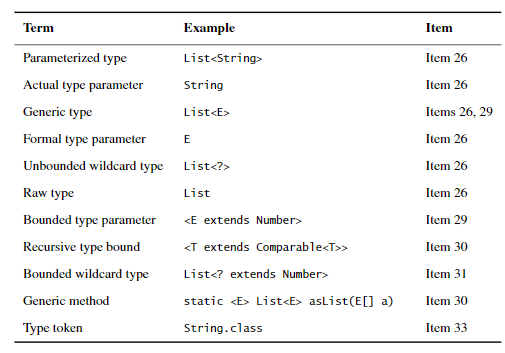

# 第二章 建立與銷毀物件的方法

## item 1 - 使用 static factory method 取代 constructors

一般來說 Java 主要以 constructors 來建立新的 instance 但是其實 Java 可以在 class 中提供  static factory method 來建立 instance

### 使用  static factory method 建立 instance 有幾種好處

* 可以有名稱 

有名稱可以讓使用物件的人容易理解如何建立此物件 instance 如: Integer.valueOf()

* 使用 static factory method 不一定要建立新的物件

可以直接回傳已建立過的物件 如: 
```java
public final class Boolean implements java.io.Serializable,
                                      Comparable<Boolean>
{
    /**
     * The {@code Boolean} object corresponding to the primitive
     * value {@code true}.
     */
    public static final Boolean TRUE = new Boolean(true);

    /**
     * The {@code Boolean} object corresponding to the primitive
     * value {@code false}.
     */
    public static final Boolean FALSE = new Boolean(false);
    
    public static Boolean valueOf(boolean b) {
        return (b ? TRUE : FALSE);
    }

}
```

*  可以在回傳回傳型別的子型別 - 參考 java.util.Collections 
*  回傳的物件可以變更 - EnumSet 在 enum 大小為 64 以下回傳 RegularEnumSet instance 以上回傳 JumboEnumSet
*  可以回傳一個 interface 不一定要先實作物件 - 參考 ServiceLoader.java  load() 方法 https://stackoverflow.com/questions/53240626/what-does-static-factories-returned-object-need-not-exist-mean

### 使用  static factory method 建立 instance 有幾種壞處

* 如果 class 只有 private constructors 不能被繼承
* static factory method 單由文件很難判斷建議以以下幾種命名法則命名

    * from—A type-conversion method that takes a single parameter and returns acorresponding instance of this type, for example:Date d = Date.from(instant);
    * of—An aggregation method that takes multiple parameters and returns an in-stance of this type that incorporates them, for example:Set<Rank> faceCards = EnumSet.of(JACK, QUEEN, KING);
    * valueOf—A more verbose alternative to from and of, for example:BigInteger prime = BigInteger.valueOf(Integer.MAX_VALUE);
    * instance  or  getInstance—Returns  an  instance  that  is  described  by  its  pa-rameters (if any) but cannot be said to have the same value, for example:StackWalker luke = StackWalker.getInstance(options);
    * create  or  newInstance—Like instance  or  getInstance,  except  that  themethod guarantees that each call returns a new instance, for example:Object newArray = Array.newInstance(classObject, arrayLen);
    * getType—Like getInstance, but used if the factory method is in a differentclass. Type is the type of object returned by the factory method, for example:FileStore fs = Files.getFileStore(path);
    * newType—Like newInstance, but used if the factory method is in a differentclass. Type is the type of object returned by the factory method, for example:BufferedReader br = Files.newBufferedReader(path);
  *   type—A concise alternative to getType and newType, for
      example:List\<Complaint> litany =
      Collections.list(legacyLitany);

## Item 2 考慮使用 build pattern 當 constructor 參數很多時

## Item 3 建立 singleton 物件的技巧: 使用 private constructor 或 enum type

 * public static final field 的方式
 
 最簡單, 但是 eager-loading
 
 * public static factory method 的方式
 
 可以有彈性的建立物件, 可以用範型, 可有用 java8 的 supplier 傳入 lambda(見註釋1)
 但是有一些序列化的問題要解決
  
 註釋1: supplier=() -> T Elvis::instance 意思是 Elvis.instance() 產生一個 Elvis 物件可以用 High order function 之特性傳入supplier functional interface
 * enum singleton
 
 比較好的方法,但是不能繼承其他 class 不過可以實作 interface 

## Item 4 用 private constructor 確保物件不能被 實例化(instantiated)

有些 class 如 util 類, 包含了很多 static method, 這些 class 其實不需要被實例化, 
因此建議以 private constructor 確保它不能被實例化.   

## Item 5 使用 dependency injection 來注入物件
以下是拼字檢查的物件,相依於 Lexicon 物件, 而 Lexicon 可能有很多不同實作如 EnglishLexicon, ChineseLexicon , 
可用 dependency injection 的方式傳入 factory pattern 之 FactoryClass 以在 constructor 產生不同實作的 Lexicon.
另外於 Java8 可使用 supplier functional interface 來限制 FactoryClass 的 type 如: Supplier<? extends Lexicon> lexiconFactory
```java
public class SpellChecker {
    private final Lexicon dictionary;

    public SpellChecker(Lexicon dictionary) {
        this.dictionary = Objects.requireNonNull(dictionary);
    }

    public boolean isValid(String word) {
    }

    public List<String> suggestions(String typo) {
    }
}
```
## Item 6 避免建立不必要的物件

在開發時盡量減少建立不必要物件如下使用 String.matches 時會建立 一個 Pattern 物件,
因此如果能先將 Pattern 建立出來則不需要每次呼叫 isRomanNumeral 時都建立 Pattern 物件.
當使用 Boxed Primitive 之物件 如 Long 時每次重新 assign 一個新 value 都會重新產生一個 Long 物件需要注意.
```java
//bad
class RomanNumerals {
    static boolean isRomanNumeral(String s) {
        return s.matches("^(?=.)M*(C[MD]|D?C{0,3})" 
                + "(X[CL]|L?X{0,3})(I[XV]|V?I{0,3})$");
    }
}
//good
class RomanNumerals {
    private static final Pattern ROMAN = Pattern.compile("^(?=.)M*(C[MD]|D?C{0,3})" + "(X[CL]|L?X{0,3})(I[XV]|V?I{0,3})$");

    static boolean isRomanNumeral(String s) {
        return ROMAN.matcher(s).matches();
    }
}
```
## Item 7 消除未使用的 物件 references
在 Java 中 memory leak 通常出現於 *未預期的物件保留(unintentional object retentions)* , 如於 Stack 陣列中維護物件而沒有 release 未使用之陣列物件.
為了保持程式的可讀性將 GC 交由 JVM 對於消除未使用的 物件 references 需要針對例外的狀況消除常見的情形有
* 維護陣列的物件參考
* 維護 cache 的物件
* Listeners 與 其他 Callbacks 物件

可試著使用 WeakHashMap 去自動消除未使用的 key 所對應的 value, 
Remember  that  WeakHashMap  is  useful  only  if  the  desired  lifetime  of cache entries is determined by external references to the key, not the value

## Item 8 避免使用 finalizers 與 cleaners
finalizers 會在 gc 後被執行, 但是 java gc 時機是由 JVM 演算法決定的因此不能保證即時性, 
並且使用它會影響 gc 效能（about 50times slower to create and destroy objects with finalizers）, 
cleaners 快一點約 5 倍, 除非要做資源釋放的保險否則不要使用.

> java 9 後 finalizers 被棄用改為 cleaners
 
 
 可使用 finalizers 與 cleaners 的情況
 * 作為資源釋放的保險, 並且這些資源可以接受非即時性的釋放 如： FileInputStream, FileOutputStream, ThreadPoolExecutor, and java.sql.Connection
 * native  peers(一個包含 native methods 的物件)的資源釋放保險, 如效能與即時性可以妥協的話, 如不能妥協請使用 AutoCloseable 實作 close method
 
## Item 9 使用 try(resource) 而不使用 try{} finally{}
 
使用 try{} finally{} 用於 resource 的關閉不只程式碼比較醜, 還可能發生第一個 exception 被偵測後而執行 close method 後發生第二個 exception 時丟出 exception Stack 的狀況造成 debug 困難, 因第一個 exception 沒印出 exception Stack message.
比如說當讀檔案時, 硬碟壞了發生 exception 然後程式碼直接跳到 close method 執行然後發生第二個 exception 則 exception Stack 顯示的 message 會是 close method 的 message.  

在 Java 7 後引入了 try(resource) 方法只要 resource 有 implement AutoCloseable interface 在 try 中可以放入 resource 這種方式不只程式碼比較漂亮, 而且還能夠發生 exception 時印出第一個 exception Stack.
     
# 第三章 Java 物件的通用方法
本章介紹物件通用方法 equals, hashCode, toString, clone 如何撰寫 finalize前面介紹過了.

## Item 10 當 overriding equals() 時須遵守的規範

```java
//Object equals method
public boolean equals(Object obj) {
     return (this == obj);
 }

```

當以下情況不要 override 
* 每個 instance 本質上是唯一的情況 

如 Thread class 表示它所生成的 instance 實際上是一個 thread 對於其 value 是較不關心的, 因此原本的 Object.equals() 之行為就足夠了.
* class 不需要提供**邏輯上相等**的判斷

如 java.util.regex.Pattern class 可以 overridden equals 去判斷兩個 Pattern 是否使用一樣的 regular expression ,
但是沒有人會想去判斷兩個 Pattern 是否一樣所以 equals 不需要 override
* superclass 已經 override 了 equals 並且不需要在提供額外的行為了

如 Set 繼承了 AbstractSet 的 equals, List 繼承了 AbstractList, Map 繼承了 AbstractMap 其 equals 已經提供足夠的行為了, 不須額外實作.
* class 是 private 或是 protected 並且你確定 equals 不會被呼叫

你可以直接 override equals 方法確保別人不會呼叫它.
```java
@Override public boolean equals(Object o) { 
    throw new AssertionError(); // Method is never called
}
```
實作 equals 需要遵守的幾個約束 
* Reflexive: 任何 x 物件的 reference value 非 null 時, x.equals(x) return true
* Symmetric: 任何 x, y物件的 reference value 非 null 時 x.equals(y) return true 並且 y.equals(x) return true.
* Transitive: 任何 x, y, z物件的 reference value 非 null , 如 x.equals(y) return true 並 y.equals(z) return true,
 則 x.equals(z) 須 return true.
* Consistent: 任何 x, y物件的 reference value 非 null, 多次的 x.equals(y) 呼叫需為不變的 true 或 false equals.
* non-nullity: 任何 x 物件的 reference value 非 null, x.equals(null) 需 return false.

Java 內建的 java.sql.Timestamp 與 java.util.Date 違反 Symmetric 不能混和用在 Collection 

java.net.URL 違反了 Consistent. equals 會根據host IP 改變結果, 同個 URL 物件如果其 host 的 IP 改變了 equals 結果可能會變

如果要 null check 時不需要 check null
```java
    @Override
    public boolean equals(Object o) {
        if (o == null) return false;
    }
```
直接使用 instanceof 如果 Object 是 null instanceof 一定回傳 false [JLS 15.20.2](https://docs.oracle.com/javase/specs/jls/se7/html/jls-15.html#jls-15.20.2)
```java
    @Override
    public boolean equals(Object o) {
        if (!(o instanceof MyType)) 
            return false;
        MyType mt = (MyType) o;
    }
```

equals 的寫法

1. 使用 == 來確認 object 的  reference value: if true 直接 return true, 省了後面的 compare 運算
2. 使用 instanceof 來確認參數是正確的型別: if not return false,
3. 將參數的型別 cast 成正確的型別: cast 因為在 instanceof 後面所以可以確保能夠 cast 成功
4. 對於傳入的物件之每個重要欄位進行比較: 如果這些欄位都通過測試則回傳 true 否則回傳 false. (如 步驟2 的參數是 interface 則使用 method 進行 compare, 如果是 class 可以由 欄位的
 accessibility 決定是否要直接使用呼叫欄位)

primitive fields 可直接用 == 比較, 如為 float double 用 Float Double compare() method 比較, 用Float.equals()會有 autoboxing 的問題會造成效能低落, 
如為物件用 equals 比較, 如為 array 用 Arrays.equals(). 

有些物件 reference value 可能是 null 可以用 Objects.equals(Object,Object) 來避免 NullPointException
```java
public final class Objects {
    public static boolean equals(Object a, Object b) {
        return (a == b) || (a != null && a.equals(b));
    }
}
```
寫完 equals 請寫 unit test 來測 Symmetric Transitive Consistent 三種特性  (Consistent 如何測？)

最後幾點 equals 的注意事項
* override equals 時也要 override hashCode
* 別自作聰明: 如果單純的比較欄位的相等已達到 equals 的約束並不會太困難. 但如果你考慮太多以去進行比較往往會造成錯誤, 
如: File class 不需要去比較 file 的 symbolic links 是否指向同一個 file .
* 不要使用在 equals(Object object) 放入其他的型別如以下, 如果這樣它會變成 overloads, 如果你試著在上面加上 @Override 會不能編譯, 因為 super class 沒有這個 method
```java
public boolean equals(MyClass o) { }
```
可以嘗試使用 autovalue 自動生成 equals, hashCode (類似 lombok).

如果不需要盡量不要 override equals method, 如 override 確保它所有重要的欄位都要被比較, 並確保其符合上面提到的五個約束.

## Item 11 當 override equals 時也要 override hashCode 

hashCode 的約束
* 如果被 equals 比較的值沒有變化那麼, 當 hashCode 被呼叫時需要一直保持一樣的回傳值
* 如果兩個物件的被 equals 判斷為 true, 這兩物件的 hashCode 須為同樣的值
* 如果兩個物件的被 equals 判斷為 false, 這兩物件的 hashCode 不一定不同. 然而須注意的是如果 unequal 的值其 hashCode 不同, 可以提高 hash tables 的效能.
 
 以下方法無違反約束, 但是會造成每次 hashCode 都回傳一樣的值, 以至於 hash table 的物件放到 Linked List 當要尋找同樣 key 的物件 reference 時會到 Linked List 找下去造成效能不好.
 ```java
// The worst possible legal hashCode implementation - never use!
@Override public int hashCode() { return 42; }
```

**hashCode 的作法**
1. int result, code; 
2. 計算從有意義的欄位計算 code
    1. 如欄位是 primitive type, 使用 Type.hashCode(f), 如 Integer.hashCode(f)
    2. 如欄位是 object 並且 class 的 equals 是由此 object 的 equals 方法實作的, 呼叫 Type.hashCode(object), 如果 object 是 null 則回傳 0.
    3. 如果欄位是 Array, 並且裡面的值都是有意義的用 Array.hashCode , 如並非全部有意義的 forEach 每個值 然後 計算  result = 31 * result + code, 
    如無意義的值 code 請設為一個非0的常數;
3. 依照以上作法 result = 31 * result + c; 計算結果 // 使用 31 在 jvm 可以使用此方法最佳化 31*i == (i<<5)-i (2 * 5 = 32, 31 = 31 - 1 shift = * 2) 並且他是質數 
[为什么Java String哈希乘数为31？](https://juejin.im/post/5ba75d165188255c6a043b96). 更好的 hashCode 法請參考 com.google.common.hash.Hashing[Guava]

快速的寫法但是效能較差 boxing and unboxing
```java
// One-line hashCode method - mediocre performance
    @Override
    public int hashCode() {
        return Objects.hash(lineNum, prefix, areaCode);
    }
```

Immutable Object Lazy load 方法
```java
    // hashCode method with lazily initialized cached hash code
    private int hashCode; // Automatically initialized to 0
    
    @Override
    public int hashCode() {
        int result = hashCode;
        if (result == 0) {
            result = Short.hashCode(areaCode);
            result = 31 * result + Short.hashCode(prefix);
            result = 31 * result + Short.hashCode(lineNum);
            hashCode = result;
        }
        return result;
    }
```
請撰寫 unit test 測一下約束 2, 如用 autovalue 自動生成可忽略測試. 可以忽略在 equals 中被比較的欄位, 但是需要注意必需忽略沒有在 equals 中被比較的欄位, 
不然可能會違反約束2.

## Item 12 總是 override toString()

雖然 override toString 並不是一定要遵守的約束, 但是能讓使用者看的比較懂, 並且比較好 Debug.

## Item 13 明智的實作 Override clone()
Cloneable 是一個空的 interface 如果 class implement Cloneable 則會改變 Object.clone() 方法的行為並按照 class 的欄位進行複製, 
如果沒有 implement 則會丟出 CloneNotSupportedException.
雖然 Cloneable interface 是空的, 但是實際上一個 class implement Cloneable 預期此 class 會實作 public clone(),
他的約束如下: 假設一個 Object x
* x.clone() != x  is true
* x.clone().getClass() == x.getClass() is true, 但是這不是絕對的 
* x.clone().equals(x) is true, 但是這不是絕對的

如果 x 的所有 superclass 實作 clone() 時是以 super.clone() 實做則 x.clone().getClass() == x.getClass()
```java
   // 為何 Override method 可以 return 非 Object 的型態, 因為 Java 支援 covariant  return  types :  
   // an  overriding  method’s  return  type  can  be  a  subclass  of  the  overridden method’s return type.
    @Override
    public PhoneNumberCloneable clone() {
        try {
            return (PhoneNumberCloneable) super.clone();
        } catch (CloneNotSupportedException e) {
            throw new AssertionError();  // Can't happen}
        }
    }
```
需要考慮的是執行 clone() 時會將 object的 reference value 一起 clone(), 因此在這種情況需要考慮 deep copy 在 clone()中, 
物件欄位的方法再次以此物件的 clone() 方法進行 clone 以進行 deep copy, 如果物件型態是 Array 如:Object[] elements 可以使用 elements.clone(), 
他會在程式執行時自動以 array 中的物件之 clone() 方法進行 clone, 注意在這裡如果 elements 是 final 的那麼在 result.elements = elements.clone();
時編譯器會報錯, 因為 elements 不能被指派為新的 clone 物件. 

一個class 要執行 thread-safe clone() 需再 clone method 上加上 synchronized lock 起來.

**總結:** 一個物件如果 implement Cloneable 需要 override clone 並以此物件型態當作回傳值. 此方法的實作需要呼叫 super.clone, 
並且對於 mutable objects 做 deep copy.

對於物件的方法 copy 除了 implement Cloneable 還可以使用 copy constructor or copy factory 方法. 這種方法可以不用遵照 clone() 的約束, 
以更有彈性的方法 copy 物件. 如: HashSet s 可以用 TreeSet 的 copy constructor 複製出一個 TreeSet. newTreeSet<>(s)

## item 14 考慮實作 Comparable

實作 Comparable 的約束
*  任何 x, y 物件 sgn(x.compareTo(y)) ==-sgn(y.compareTo(x)), 如果 x.compareTo(y) 丟出 exception, y.compareTo(x) 也會丟出 exception.
* transitive:  (x.compareTo(y) > 0 && y.compareTo(z) > 0) 則 x.compareTo(z) > 0
* x.compareTo(y) == 0 則 sgn(x.compareTo(z)) == sgn(y.compareTo(z))
* 不適必要的約束, 但是建議 (x.compareTo(y) == 0) == (x.equals(y)). 如果違反此約束需要以註解說明如: BigDecimal api 文件.
```java
/*
 * @apiNote Care should be exercised if {@code BigDecimal} objects
 * are used as keys in a {@link java.util.SortedMap SortedMap} or
 * elements in a {@link java.util.SortedSet SortedSet} since
 * {@code BigDecimal}'s <i>natural ordering</i> is <em>inconsistent
 * with equals</em>.  See {@link Comparable}, {@link
 * java.util.SortedMap} or {@link java.util.SortedSet} for more
 * information.
*/
```
和 item10 equals 一樣, 如果有一個 subclass 繼承了, 實作 Comparable class 
並且新增了一些有意義的數值欄位則可能會違反里氏替換原則(Liskov substitution principle), 因此請以複合代替繼承.

如果 Comparable 的順序和 equals 的結果不一致, 理論上可以運作, 但是使用 TreeSet 與 HashSet 會有不一樣的結果, 
舉例來說 Java 物件 BigDecimal new BigDecimal("1.0"), new BigDecimal("1.00") 加到 HashSet 會有兩個 instance, 因為 HashSet 是用 equals 比較的, 
但是使用 TreeSet 只有一個 instance, 因為 TreeSet 適用 compareTo 比較的.

實作 compareTo 的方法如下: 先比較最重要的值如果值, 不是零就直接回傳比較結果, 如果是零則繼續比較下去.
```java
// Multiple-field Comparable with primitive fields
    public int compareTo(PhoneNumberHashCodeComparable phoneNumberHashCodeComparable) {
        int result = Short.compare(areaCode, phoneNumberHashCodeComparable.areaCode);
        if (result == 0) {
            result = Short.compare(prefix, phoneNumberHashCodeComparable.prefix);
            if (result == 0)
                result = Short.compare(lineNum, phoneNumberHashCodeComparable.lineNum);
        }
        return result;
    }
```
另外再 Java8 中新增了 comparator construction method 的方法, 雖然這種方法目前跑起來速度可能會慢個 10% 但是可以提高程式碼的可讀性.
```java
// Comparator.compare(this, pn) 會將 o1 , o2 丟到 comparingXXX 然後 comparingXXX 透過 apply o1 o2 的 function 去執行比較
// java.util.Comparator.comparingInt 傳入 (T) => int  回傳  Comparator 
// Comparable with comparator construction methods
    private static final Comparator<PhoneNumberHashCodeComparable> COMPARATOR =
            java.util.Comparator.comparingInt((PhoneNumberHashCodeComparable pn) -> pn.areaCode)
                    .thenComparingInt(pn -> pn.prefix)
                    .thenComparingInt(pn -> pn.lineNum);

    public int compareTo(PhoneNumberHashCodeComparable pn) {
        return COMPARATOR.compare(this, pn);
    }
```
另外注意的是比較值的時候 不要用 < > = 等等比較運算子比較, 請用 Boxed primitive 的 compare 比較, 因為如果用 Integer 如以下範例可能會出現 integer overflow 的狀況,
 而用 float 則會出現精準度比較的問題.
```java
//bad
    static Comparator<Object> hashCodeOrder = new Comparator<>() {
        public int compare(Object o1, Object o2) {
            return o1.hashCode() - o2.hashCode();
        }
    };
//good
    static Comparator<Object> hashCodeOrder = new Comparator<>() {
        public int compare(Object o1, Object o2) {
            return Integer.compare(o1.hashCode(), o2.hashCode());
        }
    };
```
# 第四章 Classes 與 Interfaces

## Item 15 最小化 class 與其成員的可存取性

class 的成員(fields, methods, nested classes, and nested interfaces)有以下四種存取等級.
* private - 成員只可以被宣告它的 class 所存取.  
* package-private - 成員只可以被在 package 的 class 所存取, 預設所有成員都是這個,除了 interface 是預設 public
* protected - 成員可以被 class 的 subclass 及 package 中的 class 所存取.
* public - 可以被存取.

為了確保里式替換法則(Liskov substitution principle), 請確保 subclass 不會對其 override 的 method 做更進一步的存取限制. 
 
如果因為要測試需要提高存取級別, 請不要將其提高到 package-private 以上的存取級別, 因為測試程式碼可以放在同樣的 package 底下測試. 
 **PS: main/java/package, test/java/package 兩個是同樣 package** 

**Instance fields** 請盡量不要設為 public, 如果 fields 是 nonfinal 並且指向可變物件, 則將會導致大家可以存取它並且因為不能限制存取狀態的方法會讓此 class 變成非 thread safe class.

如果此 fields 是 final 並且指向不可變物件, 也會引響你對於改變使 field 的彈性. 

對於那些 static final 的 fields 只能夠開放 primitive value 及 immutable object 使用 public, 如果開放了 mutable object 則會導致一些錯誤發生,

將 mutable array field 改變為 immutable array:
```java
// Potential security hole!
public static final Thing[] VALUES =  { ... };

private static final Thing[] PRIVATE_VALUES = { ... };
public static final List<Thing> VALUES =    Collections.unmodifiableList(Arrays.asList(PRIVATE_VALUES))
// or
private static final Thing[] PRIVATE_VALUES = { ... };
public static final Thing[] values() {
    return PRIVATE_VALUES.clone();
}

``` 
在 Java 9 導入了 _模組化系統(module  system)_ 一個模組代表一組的 packages, 一個 package 代表一組的 classes. 模組可以透過宣告 export 的方式開放 packages 的存取權限
(通常模組宣告會放在一個名稱為 module-info.java 的檔案中).
如果將模組化的 Jar 檔案放在 class 路徑而不是放在模組化路徑則會導致模組化功能失效.

## Item 16 在 public class 使用存取方法而不要使用 public fields

if a class is package-private or is a private nested class, there is nothing inherently wrong with exposing its data fields.

public class 不應該開放可變欄位. 對於不可變欄位雖然有爭議, 但是還算是可以開放, 而對於 private 與 package-private 物件可以依照需求決定是否開放.

## Item 17 最小化可變性

為了讓 class 能夠 immutable 請根據以下規則設計 class.
1. 不要提供改變 class 狀態的方法 (mutators).
2. 確保 classs 不能被繼承. 
3. 將所有欄位設為 final. [JSL 17.5. final Field Semantics](https://docs.oracle.com/javase/specs/jls/se8/html/jls-17.html#jls-17.5).
4. 將所有欄位設為 private. 雖然可以開放但請參考 item15 16  
5. 限制那些包含 mutable object reference value 的欄位的存取, 另外可參考 Make  defensive  copies(item50) readObject methods(item88).

**Immutable objects are inherently thread-safe; they require no synchronization.**

**Not only can you share immutable objects, but they can share their inter-nals.**
```java
    
    final int signum;
    final int[] mag;
    /**
     * This internal constructor differs from its public cousin
     * with the arguments reversed in two ways: it assumes that its
     * arguments are correct, and it doesn't copy the magnitude array.
     */
    public BigInteger negate() {
        return new BigInteger(this.mag, -this.signum);
    }
    // magnitude 是同一個 array reference 只改變 signum 不需重新生成 array 
    BigInteger(int[] magnitude, int signum) {
        this.signum = (magnitude.length == 0 ? 0 : signum);
        this.mag = magnitude;
        if (mag.length >= MAX_MAG_LENGTH) {
            checkRange();
        }
    }
```
**Immutable objects make great building blocks for other objects,**
因為 Immutable 所以比較好維護 component 的狀態, 如 map 的 keys, set 的 elements 因為 Immutable 所以可以放心地使用.


**Immutable objects provide failure atomicity for free** - item 76

**The  major  disadvantage  of  immutable  classes  is  that  they  require  aseparate  object  for  each  distinct  value.**

```java
// moby BigInteger 很大很大 只改一個 bit 花了很多時間 因為 Immutable 只能重新建立
BigInteger moby = ...; 
moby = moby.flipBit(0);
// muutable object 只改一個 bit 就好了
BitSet moby = ...;
moby.flip(0);
```
解決方法:
提供 **companion class** 於內部提供可變物件以加速運算. 如: BigInteger 與 MutableBigInteger, 於外部提供可讓使用者自由操作. 
如: String 與 StringBuilder 與 StringBuffer

很久以前 JDK 開發 BigInteger 與 BigDecimal 並不知道要將其 class 宣告為 final. 所以他們可能被其他 class 繼承, 
因此建議如果你開發一個 class 使用到一個 class 是繼承了這兩個 class, 可以使用以下方法將它轉換為正確的物件
```java
    public static BigInteger safeInstance(BigInteger val) {
        return val.getClass() == BigInteger.class ? val : 
        new BigInteger(val.toByteArray());
    }
```
immutable classes 的定義 no method may produce an externally visible change in the object’s state, 
並非所有的欄位都需要 final 與無方法可以修改物件. 某些情況可以透過一些 nonfinal fields 來加速運算速度. 
例如：上面 Item 11 的 範例 Immutable Object Lazy load 方法 用一個 result 儲存 hashcode 的 cache 以加速運算.

總結： 不要衝動的每個 getter 都寫一個 setter. 如果沒有特別的理由盡量讓類別保持不可變. 
**類別欄位如果可以就宣告成 private final.**. object 盡量重複使用, method 盡量回傳以生成的 object. 
java.util.concurrent.CountDownLatch 可以用來參考, 它雖然並非 immutable 但是基本上會保持狀態改變最小化.

## item 18 複合(Composition)優於繼承
 
此處指的 **inheritance** 指的是 implementation inheritance 並非,  interface inheritance

**繼承違反封裝**: 當子類別行為依賴於父類別的實作時, 改變父類別, 子類別繼承下來的方法行為會被改變, 因此子類別有很大的機率需要更改程式碼.

例如： testInstrumentedHashSet method getAddCount 預計是3, 但是實際卻回傳 6 ,
因為 HashSet 的 addAll() 會呼叫 add(), 因此在 InstrumentedHashSet addAll() 呼叫 super.addAll(c) 
同時又會呼叫了以繼承的 add() 方法造成重複計算, 雖然可以自己改變 addAll() 的實作讓他的行為正確, 
但是你永遠不知道未來 JDK 會如何實作, 除非把 addAll() 的 override 取消掉. 雖然你也可以自己在子類別寫一些方法, 
但是萬一有天父類別實作了同樣名稱的方法, 並且此方法和你的方法回傳型態不一樣, 那你的程式就不能編譯了.

而如果你使用複合, 則這些都不是問題, 因為良好封裝的物件, 它的行為不會因為實作而有改變, 
因此你可以放心的使用複合在新的 class 中將要複合的物件宣告成 private field 並透過這個 field 轉發(forwarding) method 以達到
重複使用 method 的目的.

繼承只適合用在子類別真的需要為子型態的情形:
使用繼承時請確認子類別和父類別是 is-a 的關係. 當 B extend A 時
問問自己 B 是否真的是一種 A? 在 Java 中其實有很多設計錯誤的繼承,
例如: Properties extends Hashtable, Stack\<E> extends
Vector\<E> 基本上都應該用複合設計.

## Item 19  設計並解釋如何繼承 class, 否則禁止繼承
使用 Java8 引入的 @implSpec 撰寫 class 時明確的說明可能會被繼承使用的 method 其詳細實作規格,可讓繼承此 class 的人了解原本的方法實作細節 如下:
java.util.AbstractCollection
```java
    /**
     * {@inheritDoc}
     *
     * @implSpec
     * This implementation iterates over the collection looking for the
     * specified element.  If it finds the element, it removes the element
     * from the collection using the iterator's remove method.
     *
     * <p>Note that this implementation throws an
     * {@code UnsupportedOperationException} if the iterator returned by this
     * collection's iterator method does not implement the {@code remove}
     * method and this collection contains the specified object.
     *
     * @throws UnsupportedOperationException {@inheritDoc}
     * @throws ClassCastException            {@inheritDoc}
     * @throws NullPointerException          {@inheritDoc}
     */
    public boolean remove(Object o) 

```
可以提供一些 protected 方法供 subclass 進行程式碼最佳化.
java.util.AbstractList
```java
    /**
     * Removes from this list all of the elements whose index is between
     * {@code fromIndex}, inclusive, and {@code toIndex}, exclusive.
     * Shifts any succeeding elements to the left (reduces their index).
     * This call shortens the list by {@code (toIndex - fromIndex)} elements.
     * (If {@code toIndex==fromIndex}, this operation has no effect.)
     *
     * <p>This method is called by the {@code clear} operation on this list
     * and its subLists.  Overriding this method to take advantage of
     * the internals of the list implementation can <i>substantially</i>
     * improve the performance of the {@code clear} operation on this list
     * and its subLists.
     *
     * @implSpec
     * This implementation gets a list iterator positioned before
     * {@code fromIndex}, and repeatedly calls {@code ListIterator.next}
     * followed by {@code ListIterator.remove} until the entire range has
     * been removed.  <b>Note: if {@code ListIterator.remove} requires linear
     * time, this implementation requires quadratic time.</b>
     *
     * @param fromIndex index of first element to be removed
     * @param toIndex index after last element to be removed
     */
    protected void removeRange(int fromIndex, int toIndex)
```

如果你要設計可以讓別人繼承的 class 請遵守以下規則

*  Constructors 不能呼叫可以被 override 的 method - 你只能呼叫 private methods, final methods, and static methods 這些不能被 override 的 method

SuperClass 的 constructor 會先於 SubClass 的 constructor 呼叫, 因此如果 SubClass 的 override 依賴於 SubClass 的 field 則會發生問題. 
可參考 item19 範例

* 當你設計好你的 class 請確保你會依照你目前的實作對未來的修改進行限制, 以確保 subclass 不會因為你的實作而造成行為改變


總結: 設計一個可以被繼承的 class 是很困難的. 你必須要對可被繼承的方法進行限制確保它未來的實作不會改變子類別的行為, 
並以文件說明它會呼叫什麼可被繼承的方法, 及如何實作. 
另外為了提供 subClass 最佳化程式碼, 你還需要設計一個 protected methods 提供子類別呼叫. 

除非你確認這個 class 會被繼承否則, 請將 class 設為 final 或是將 constructors 設為 private.

## item 20 interface 優於 abstract class
* **Existing classes can easily be retrofitted to implement a new interface.**

使用 interface 可以讓你的 class 被更容易的擴充, 例如: 現有的  class 可以透過 implement Comparable, Iterable, Autocloseable 
以實作這些 interface 的功能以擴充 class 之功能, 但是如果你使用 abstract class 則必須透過繼承擴充.

* **Interfaces are ideal for defining mixins**: // mixin trait 有什麼不同?
 
mixin 可以讓你透過實作另一型態的方法使你的 class 混入另一種額外型態.

* **Interfaces allow for the construction of nonhierarchical type frameworks.** : 

interface 可以讓你建立非階層式類別, 例如: 
以下 歌手與作曲家的 interface, 可能有些歌手同時也是作曲家, 如果你使用 interface 可以在一個 class 中同時 implement Singer, Songwriter 兩個 interface, 
或是建立一個 interface SingerSongwriter 繼承  Singer, Songwriter 在實作它. 
```java
public interface Singer {
    AudioClip sing(Song s);
}
public interface Songwriter {
    Song compose(int chartPosition);
}

public interface SingerSongwriter extends Singer, Songwriter {
    AudioClip strum();
    void actSensitive();
}

```
* Interface 使用 item18 的 wrapper class 方法以安全並強大的方式擴充程式碼

如果你使用 abstract classes 以定義型別, 你將需要透過繼承來擴充 class 這樣反而比 wrapper class 的方法更不安全且脆弱. (繼承很危險 item18)

在 java8 你可以使用 default method 但是有一些限制需要注意
* 你不能提供 equals 與 hashCode 的 default method
* interface 不允許有 instance fields, 或是非 public 的 static members, 但是可以有 private static methods
* 你不能加入 default methods 到你所不能控制的 interface

 你可以結合 abstract 與 interface 來建立一個 `skeletal implementation class ` 通常來說 skeletal implementation classes 命名規則已 Abstract + Interface 來命名
 如: Java Collections Framework - AbstractCollection, AbstractSet, AbstractList, AbstractMap 
  
設計一個 skeletal implementation 可以讓使用者更加容易的實作 interface 以下是一個以 skeletal implementation class 建立的 Adapter 範例
```java
// 此 method 將 int[] 轉為 List 來操作
// Concrete implementation built atop skeletal implementation
static List<Integer> intArrayAsList(int[] a) {
    Objects.requireNonNull(a);
    // The diamond operator is only legal here in Java 9 and later
    // If you're using an earlier release, specify <Integer>
    return new AbstractList<>() {
        @Override
        public Integer get(int i) {
            return a[i];  // Autoboxing (Item 6)}
        }
        @Override public Integer set ( int i, Integer val){
            int oldVal = a[i];
            a[i] = val;     // Auto-unboxing
            return oldVal;  // Autoboxing
        }
        @Override public int size () {
            return a.length;
        }
    };
}
    
```
實作 skeletal implementation 其實很簡單的只是很繁瑣, 
1. 首先根據你的 interface 決定那些 method 是要給其他 method implement 的不提供 default method
2. 在其他你要直接 implement 的方法, 提供 default method
3. if 這個 interface 已經達到你的要求了完成, else 以一個 abstract class implement 這個 interface 提供 non public fields 與 methods 完成任務.

下面是一個 Skeletal implementation class AbstractMapEntry 的範例它 implement 了 Entry interface 
讓你自己實作 K getKey(), V getValue() method 並提供 setValue 讓你選擇實作, 需要 
```java
// Skeletal implementation class
public abstract class AbstractMapEntry<K, V> implements Map.Entry<K, V> {
    // Entries in a modifiable map must override this method
    @Override
    public V setValue(V value) {
        throw new UnsupportedOperationException();
    }

    // Implements the general contract of Map.Entry.equals
    @Override
    public boolean equals(Object o) {
        if (o == this) return true;
        if (!(o instanceof Map.Entry)) return false;
        Map.Entry<?, ?> e = (Map.Entry) o;
        return Objects.equals(e.getKey(), getKey()) && Objects.equals(e.getValue(), getValue());
    }

    // Implements the general contract of Map.Entry.hashCode
    @Override
    public int hashCode() {
        return Objects.hashCode(getKey()) ^ Objects.hashCode(getValue());
    }

    @Override
    public String toString() {
        return getKey() + "=" + getValue();
    }
}

interface Entry<K, V> {

    K getKey();

    V getValue();

    V setValue(V value);

    boolean equals(Object o);

    int hashCode();

    public static <K extends Comparable<? super K>, V> Comparator<Map.Entry<K, V>> comparingByKey() {
        return (Comparator<Map.Entry<K, V>> & Serializable)
            (c1, c2) -> c1.getKey().compareTo(c2.getKey());
    }

    public static <K, V extends Comparable<? super V>> Comparator<Map.Entry<K, V>> comparingByValue() {
        return (Comparator<Map.Entry<K, V>> & Serializable)
            (c1, c2) -> c1.getValue().compareTo(c2.getValue());
    }

    public static <K, V> Comparator<Map.Entry<K, V>> comparingByKey(Comparator<? super K> cmp) {
        Objects.requireNonNull(cmp);
        return (Comparator<Map.Entry<K, V>> & Serializable)
            (c1, c2) -> cmp.compare(c1.getKey(), c2.getKey());
    }

    public static <K, V> Comparator<Map.Entry<K, V>> comparingByValue(Comparator<? super V> cmp) {
        Objects.requireNonNull(cmp);
        return (Comparator<Map.Entry<K, V>> & Serializable)
            (c1, c2) -> cmp.compare(c1.getValue(), c2.getValue());
    }
}

```
通常 skeletal implementation 透過 abstract implement interface 來達到取兩者的優點並由 subclass 實作, 
但需要注意的是它是設計來給 subclass 繼承的, 所以請注意依照 item19 的方法來實作.

另外  skeletal implementation 有一種變種的方式一個 class 直接 implement interface 如: AbstractMap.SimpleEntry 
這個 class 它也是 implement interface 並可用來繼承的, 你可以直接使用這個 class 或是在某種情況下繼承這個 class.

## Item 21  設計可以流傳後世的 Interface   
在 Java 8 我們可以在 interface 中使用 default, 但是我們可能想像不到加入一個 default method 可能對某些特殊實作造成那些影響.

舉例來說以下是 Java8 Collection interface 中所引入的 default method 這個 method 看起來很簡單, 
只是傳入一個 function: T -> boolean 如果 boolean 回傳 true 就刪除. 
```java
    // Default method added to the Collection interface in Java 8
    default boolean removeIf(Predicate<? super E> filter) {
        Objects.requireNonNull(filter);
        boolean result = false;
        for (Iterator<E> it = iterator(); it.hasNext(); ) {
            if (filter.test(it.next())) {
                it.remove();
                result = true;
            }
        }
        return result;
    }

```
但是使用在某些實作像是 Apache Commons library 的 SynchronizedCollection 則可能會在 runtime 時發生 ConcurrentModificationException.

其實在 JDK 中 Collections.synchronizedCollection class 也會發生類似的狀況, 但是它是 JDK 的一部分在開發時預料到這種狀況, 
所以透過 override removeIf 來避免這種狀況. 而對於那些不是 JDK 的 library 則可能會發生無法預料的狀況.

因此設計 interface 時想清楚你設計的 default 是否會影響到某些實作, 因為當你 interface release 出去了為了保持向下相容, 你就不能再更改 interface 了.

## item 22 只在定義型別時用 interface
在使用 interface 時常常有人將其用來定義常數以讓其只包含常數而不包含 method 這種 interface 通稱為 _constant  interface_ 如下:
```java
// Constant interface antipattern - do not use!
public interface PhysicalConstants {
    // Avogadro's number (1/mol)
    static final double AVOGADROS_NUMBER   = 6.022_140_857e23;
    // Boltzmann constant (J/K)
    static final double BOLTZMANN_CONSTANT = 1.380_648_52e-23;
    // Mass of the electron (kg)
    static final double ELECTRON_MASS      = 9.109_383_56e-31;
}
```
使用這種 interface 雖然不會怎樣, 但是當你 implement 了它, 以後你要移除它就困難了, 因為所有的 subclass 將會有這些常數, 或是某些使用這個 class 的使用者會用到這些常數.

在 Java library 中其實也有這種 interface ObjectStreamConstants 但是你應該當它為特例不要模仿它.

如果你要使用常數請寫一個 util class 然後加入這些常數 class . 另外再 java7 後你可以在數字加上下畫線 _ 以讓數字分隔單位更容易看清楚. 
```java
// Constant utility class
public class PhysicalConstants {
    private PhysicalConstants() { }  // Prevents instantiation

    public static final double AVOGADROS_NUMBER = 6.022_140_857e23;
    public static final double BOLTZMANN_CONST = 1.380_648_52e-23;
    public static final double ELECTRON_MASS = 9.109_383_56e-31;
}
```

## item 23 Prefer class hierarchies to tagged classes (以繼承來標記類別型態)
以下程式碼使用一個欄位 Shape 來表示此類別 Figure 的不同的形態 RECTANGLE 與 CIRCLE.
```java
public class FigureBad {
    enum Shape {RECTANGLE, CIRCLE};

    // Tag field - the shape of this figure
    final Shape shape;

    // These fields are used only if shape is RECTANGLE
    double length;
    double width;

    // This field is used only if shape is CIRCLE
    double radius;

    // Constructor for circle
    FigureBad(double radius) {
        shape = Shape.CIRCLE;
        this.radius = radius;
    }
    // Constructor for rectangle
    FigureBad(double length, double width) {
        shape = Shape.RECTANGLE;
        this.length = length;
        this.width = width;
    }

    double area() {
        switch (shape) {
            case RECTANGLE:
                return length * width;
            case CIRCLE:
                return Math.PI * (radius * radius);
            default:
                throw new AssertionError(shape);
        }
    }
}
```
以這種方式來表示類別型態是很不好的, 它有很多的缺點像是: 可讀性差, 記憶體被無關緊要的欄位占用, 
欄位不能設為 final 因為有些欄位是專屬某個型態的你不能在 constractor 時指派欄位值. 
像這種時候應該使用繼承的方式, 設一個 abstract class Figure 然後用 class Circle, class Rectangle 來繼承它以表示它的型態.
## item 24: static member class 優於 nonstatic
先看 [Oracle Java Tutorials Nested Object](https://docs.oracle.com/javase/tutorial/java/javaOO/nested.html)

**enclosing instance: Outer Class 的 instance**

本 item 重點:一個 nonstatic member class 會有一個 reference value this 指到它的 enclosing instance, 因此如果這個 member clas 
的 reference value 沒被釋放則 this 指到的 enclosing instance 無法被 GC

**If you declare a member class that does not require access to an enclosing instance, always put the static modifier in its declaration**
如果你定義了一個 member class 不會存取 enclosing instance 的 private member, 請加上 static

## item 25:  限制每個 .java 檔案只宣告一個 class

不要再一個 .java 檔案宣告多個 class, 如果真的需要請用 static member class

# 第五章 泛型

## item 26:  不要使用 raw types

class 或 interface 如果宣告了 _type parameters_ 則可稱作 _generic class
or interface_.

Generic classes and interfaces are collectively known as _generic
types_.

each generic type defines a _raw type_ . example the raw type
corresponding to List\<E> is List.

List\<String> is a subtype of the raw type List, but not of the
parameterized type List\<Object>.
[參考官方文件泛型繼承子型別](https://docs.oracle.com/javase/tutorial/java/generics/inheritance.html)
如果要傳入不特定的泛型參數請用 *unbounded wildcard types* 如:
Set<?> s1

### 使用 raw Type 的例外狀況 
.class 與 instanceof 不能用泛型

**You must use raw types in class literals.** List.class,
String[].class, and int.class are all legal, but
List\<String>.class and List<?>.class are not

**This is the preferred way to use the instanceof operator with generic types**
```java
// Legitimate use of raw type - instanceof operator
if (o instanceof Set) {       // Raw type
    Set<?> s = (Set<?>) o;    // Wildcard type
}

```

## item 27: 消除 unchecked warnings

在 Java 中常常會出現 unchecked warnings 讓你知道這裡可能會有
runtime error 的狀況, 通常這些 unchecked warnings
是可以透過一些方法消除的如下：
```java
//assign raw type HashSet to Set of Lark 可能會有非 Lark 型態的 HashSet runtime error
Set<Lark> exaltation = new HashSet();
// 加入 <> 讓 java7 後的編譯器 type infer 
Set<Lark> exaltation = new HashSet<>();
```

有些時候你可能無法消除這個警告, 這時候如果你能夠證明你的 code 不會
runtime error 你可以加上 ＠SuppressWarnings 以壓制這個警告,
並且寫註解以告訴別人為何他是 typesafe 以防別人修改 code 後出現
runtime error.

盡可能在最小範圍內使用你的 @SuppressWarnings("unchecked") 
```java
//  這個 ArrayList 的 toArray 可以不用使用在 method 上, 而是使用在 return 上面縮小範圍  
    @SuppressWarnings("unchecked")
    public <T> T[] toArray(T[] a) {
        if (a.length < size)
            // Make a new array of a's runtime type, but my contents:
            return (T[]) Arrays.copyOf(elementData, size, a.getClass());
        System.arraycopy(elementData, 0, a, 0, size);
        if (a.length > size)
            a[size] = null;
        return a;
    }
```

## Item 28: 偏好使用 Lists 而不是 arrays

arrays are covariant
 
Generics, by contrast, are invariant

arrays are reified

generic types erasure

非法 new List\<E>[], new List\<String>[], new E[] non-reifiable
types

合法 new List\<?>[] reifiable types 
```java 
    // Why generic array creation is illegal - won't compile!
    List<String>[] stringLists = new List<String>[1];  // (1)
    List<Integer> intList = List.of(42);// (2)
    Object[] objects = stringLists;// (3)
    objects[0] = intList;// (4)
    String s = stringLists[0].get(0);// (5)
```

## item 29: 偏好使用 generic type

本章介紹了將以 generic type 取代 Object 的方法. 在使用 generic type
時如果 class 有 generic array field 如: private E[] elements; , 而不能
new 時 有兩種方法可以解決:

1. 將 constructor 的 new E[] 轉為 Object[] 然後再 cast 
2. 將 field 的 E[] 轉為 Object[] 然後再 cast 每個 element 為 E 

## item 30: 偏好使用 generic method

範形方法用法：將你的 type parameters 宣告在 method 的 modifiers
與 return type 之間. 如：
```java
// Generic method
public static <E> Set<E> union(Set<E> s1, Set<E> s2) {
        Set<E> result = new HashSet<>(s1);
        result.addAll(s2);
        return result;
    }
```

*generic singleton factory* **Collections.reverseOrder** **Collections.emptySet.**

<E extends Comparable\<E>> may be read as “any type E that can
be compared to itself, 常用在 collection 的 method 中 用來 sort
search 與計算最大最小.

## item 31: 使用 bounded wildcards 以加強 API 的靈活度

Generics are invariant 所以 List\<Super> 與 List\<Sub> 兩個 type 無並非
super sub type 的關係. 

如果你在某個 class Stack<E> 使用了 Stack<Number> = new Stack(); 而他的
method 使用 generics 而不是 wildcard 則你將不能在 method 使用 Number 的
sup type, 請參考以下 pushAll method 以 bounded wildcards 取代 generics
可以放入任何 E 的 subtype.

```java
public void pushAll(Iterable<? extends E> src) {
    for (E e : src)
        push(e);
}

public void popAll(Collection<? super E> dst) {
        while (!isEmpty()) 
            dst.add(pop());
}
``` 

上面方法 pushAll 會將參數放進去 Stack 中對於 Stack
來說這個參數是一個生產者, 一般來說生產者的參數, 因為要放進去 Stack
所以他需要是 subtype wildcard 因該使用 extend.

上面方法 popAll 會將 Stack 的值放到參數中對於 Stack
來說這個參數是一個消費者, 一般來說消費者, 因為要將 Stack
的值放進去因此它因該是 Stack 的值的 super type 因該使用 super.

你可以使用這個記憶法記憶, 什麼時候使用 extend super PECS stands for
producer-extends, consumer-super

<T extends Comparable<? super T>> -> T 需要實作 Comparable<T 的
supertype> ex: Cat implement Comparable<Animal>


if a type parameter appears only once in a method declaration, replace
it with a wildcard.
[看這個:類型參數和通配符的選擇](https://www.jyt0532.com/2018/12/23/how-to-choose-between-wildcard-and-generic-method/)
 
Also remember that all comparables and comparators are consumers. 因為
comparables 物件要將值放進去 compare 所以他是消費者

## Item 32: 明智的使用 generics 與 varargs

non reifiable type is one whose runtime representation has less
information than its compile-time representation

```java
    // Mixing generics and varargs can violate type safety!
    static void dangerous(List<String>... stringLists) {
        List<Integer> intList = List.of(42);
        Object[] objects = stringLists;
        objects[0] = intList;              // Heap pollution  
        String s = stringLists[0].get(0); // ClassCastException
    }
```
可以編譯, 因為某些情況 generics 與 varargs 合用有意義像是:
Arrays.asList(T...a),
Collections.addAll(Collection<?superT>c,T...elements), and EnumSet.of(E
first,E...rest) 

@SafeVarargs 可以告訴 compile 他們是安全的, 但是要如何確保安全. if the
varargs parameter array is used only to transmit a variable number of
arguments from the caller to the method—which is, after all, the
purpose of varargs—then the method is safe.


```java
    // UNSAFE - Exposes a reference to its generic parameter array! 
    static <T> T[] toArray(T... args) { 
        return args; 
    }
    // pickTwo will always return an array of type Object[]
    static <T> T[] pickTwo(T a, T b, T c) {
        switch (ThreadLocalRandom.current().nextInt(3)) {
            case 0:
                return toArray(a, b);
            case 1:
                return toArray(a, c);
            case 2:
                return toArray(b, c);
        }
        throw new AssertionError(); // Can't get here
    }
    public static void main(String[] args) {   
        String[] attributes = pickTwo("Good", "Fast", "Cheap");
    }
``` 
**it is unsafe to give another method access to a generic varargs
parameter array**, with two exceptions:
1. it is safe to pass the array to another varargs method that
is correctly annotated with @SafeVarargs, and 
2. it is safe to pass the
array to a non-varargs method that merely computes some function of the
contents of the array

```java
// Safe method with a generic varargs parameter
@SafeVarargsstatic
<T> List<T> flatten(List<? extends T>... lists) {
    List<T> result = new ArrayList<>();
    for (List<? extends T> list : lists) result.addAll(list);
    return result;
}
``` 
**Use @SafeVarargs on every method with a varargs
parameter of a generic or parameterized type**


As a reminder, a generic varargs methods is safe if:
1. it doesn’t store anything in the varargs parameter array 
2. it doesn’t make the array (or a clone) visible to untrusted code.

Note that the SafeVarargs annotation is legal only on methods that
can’t be overridden, because it is impossible to guarantee that every
possible overridingmethod will be safe. 

```java
    // List as a typesafe alternative to a generic varargs parameter
    static <T> List<T> flatten(List<List<? extends T>> lists) {
        List<T> result = new ArrayList<>();
        for (List<? extends T> list : lists) result.addAll(list);
        return result;
    }
    audience = flatten(List.of(friends, romans, countrymen));

    static <T> List<T> pickTwo(T a, T b, T c) {
        switch (rnd.nextInt(3)) {
            case 0:
                return List.of(a, b);
            case 1:
                return List.of(a, c);
            case 2:
                return List.of(b, c);
        }
        throw new AssertionError();
    }
    
    public static void main(String[] args) {
        List<String> attributes = pickTwo("Good", "Fast", "Cheap");
    }
```

## Item 33: Consider typesafe heterogeneous containers

Common uses of generics:  
* collections, such as Set<E> and Map<K,V>
* single-element  containers,  such  as  ThreadLocal<T>  and  AtomicReference<T>

一個容器通常只能傳幾個參數型別, 如要實作如 database row 有任意的
columns 不同型別的物件不方便. 替代方案: **parameterize the key
instead of the container** 

String.class is of type Class<String>, and Integer.class is of
type Class<Integer>. When a class literal is passed among
methods to communicate both compile-time and runtime type
information, it is called a **type token**

```java
public class Favorites {

    public <T> void putFavorite(Class<T> type, T instance) {
        favorites.put(Objects.requireNonNull(type), instance);
    }

    public <T> T getFavorite(Class<T> type) {
        return type.cast(favorites.get(type));
    }

    // Typesafe heterogeneous container pattern - client
    public static void main(String[] args) {
        Favorites f = new Favorites();
        f.putFavorite(String.class, "Java");
        f.putFavorite(Integer.class, 0xcafebabe);
        f.putFavorite(Class.class, Favorites.class);
        String favoriteString = f.getFavorite(String.class);
        int favoriteInteger = f.getFavorite(Integer.class);
        Class<?> favoriteClass = f.getFavorite(Class.class);
        System.out.printf("%s %x %s%n", favoriteString, favoriteInteger, favoriteClass.getName());
    }
}
```


```java
public class Class<T> {
    @HotSpotIntrinsicCandidate
    public T cast(Object obj) {
        if (obj != null && !isInstance(obj))
            throw new ClassCastException(cannotCastMsg(obj));
        return (T) obj;
    }
}
```

two limitations to the Favorites class:
1. a malicious client could easily corrupt the type safety of a
   Favorites instance, by using a Class object in its raw form. [解釋請看](https://stackoverflow.com/questions/35961017/parameterized-type-keys-for-map)
   解決
```java
// Achieving runtime type safety with a dynamic cast
public <T> void putFavorite(Class<T> type, T instance) {
    favorites.put(type, type.cast(instance));
}
``` 
2. it cannot be used on anon-reifiable type. 

you can store your favorite String orString[], but not your favorite
List\<String>. The class literal List<String>.class is a syntax  error,


The annotations API (Item 39) makes extensive use of **bounded type token**

```java
public interface AnnotatedElement {
    <T extends Annotation> T getAnnotation(Class<T> annotationClass);
}

// Use of asSubclass to safely cast to a bounded type token
    static Annotation getAnnotation(AnnotatedElement element, String annotationTypeName) {
        Class<?> annotationType = null; // Unbounded type token
        try {
            annotationType = Class.forName(annotationTypeName);
        } catch (Exception ex) {
            throw new IllegalArgumentException(ex);
        }
        return element.getAnnotation(annotationType.asSubclass(Annotation.class));
    }
```

# 第六章 Enums 與 Annotations

## item 34: 使用 enums 以替代 int 常數
**enumerated type** 一般可用來表示一系列的常數如: 四季, 太陽系行星,
與撲克牌圖案. 在 Java 引入 enum 之前可以使用常數的方式來替代 enum.
但是因為沒有完整的型別無法透過編譯期檢查一些型別問題,
這其實是很不安全的.
```java
    // The int enum pattern - severely deficient!
    public static final int APPLE_FUJI = 0;
    public static final int APPLE_PIPPIN = 1;
    public static final int APPLE_GRANNY_SMITH = 2;
    public static final int ORANGE_NAVEL = 0;
    public static final int ORANGE_TEMPLE = 1;
    public static final int ORANGE_BLOOD = 2;
    
```

以下是一個 enum 的範例它提供了 8 個 enum 這個特殊的 class 的 instance
並且於程式啟動時建立. 並且能夠存取他的 method.
```java
public enum Planet {
    MERCURY(3.302e+23, 2.439e6),
    VENUS(4.869e+24, 6.052e6),
    EARTH(5.975e+24, 6.378e6),
    MARS(6.419e+23, 3.393e6),
    JUPITER(1.899e+27, 7.149e7),
    SATURN(5.685e+26, 6.027e7),
    URANUS(8.683e+25, 2.556e7),
    NEPTUNE(1.024e+26, 2.477e7);

    private final double mass;           // In kilograms
    private final double radius;         // In meters
    private final double surfaceGravity; // In m / s^2

    // Universal gravitational constant in m^3 / kg s^2
    private static final double G = 6.67300E-11;

    // Constructor
    Planet(double mass, double radius) {
        this.mass = mass;
        this.radius = radius;
        surfaceGravity = G * mass / (radius * radius);
    }

    public double mass() {
        return mass;
    }

    public double radius() {
        return radius;
    }

    public double surfaceGravity() {
        return surfaceGravity;
    }

    public double surfaceWeight(double mass) {
        return mass * surfaceGravity;  // F = ma
    }
}
public class WeightTable {
    public static void main(String[] args) {
        double earthWeight = Double.parseDouble("185");
        double mass = earthWeight / Planet.EARTH.surfaceGravity();
        for (Planet p : Planet.values()) // enum 提供 values() 回傳 enum 的 field 陣列
            System.out.printf("Weight on %s is %f%n", p, p.surfaceWeight(mass));
    }
}
```

在設計 enum 時你可能會根據抹些 instance 的來做判斷要執行什麼程式, 你可以用
switch case 判斷.
```java
public enum Operation {
    PLUS, MINUS, TIMES, DIVIDE;

    // Do the arithmetic operation represented by this constant
    public double apply(double x, double y) {
        switch (this) {
            case PLUS:
                return x + y;
            case MINUS:
                return x - y;
            case TIMES:
                return x * y;
            case DIVIDE:
                return x / y;
        }
        throw new AssertionError("Unknown op: " + this);
    }
}
``` 
但是這樣有問題萬一你新增一個 instance 而忘了實作 case 則會 error 你可以使用
ConstantSpecific 方法實作.
```java
public enum OperationConstantSpecific {

    PLUS {
        public double apply(double x, double y) {
            return x + y;
        }
    },
    MINUS {
        public double apply(double x, double y) {
            return x - y;
        }
    },
    TIMES {
        public double apply(double x, double y) {
            return x * y;
        }
    },
    DIVIDE {
        public double apply(double x, double y) {
            return x / y;
        }
    };

    public abstract double apply(double x, double y);
}
```

使用 ConstantSpecific 方法實作有個缺點 enum 方法無法 share method
中共同的 value, 如下有 basePay, overtimePay 這兩個 value
如果不想複製貼上, 只能使用 switch case
```java
public enum  PayrollDay {
    MONDAY, TUESDAY, WEDNESDAY, THURSDAY, FRIDAY, SATURDAY, SUNDAY;
    private static final int MINS_PER_SHIFT = 8 * 60;

    int pay(int minutesWorked, int payRate) {
        int basePay = minutesWorked * payRate;
        int overtimePay;
        switch (this) {
            case SATURDAY:
            case SUNDAY: // Weekend
                overtimePay = basePay / 2;
                break;
            default: // Weekday
                overtimePay = minutesWorked <= MINS_PER_SHIFT
                        ? 0
                        : (minutesWorked - MINS_PER_SHIFT) * payRate / 2;
        }
        return basePay + overtimePay;
    }
}
```
但是這樣可能又會忘了實作新的 instance 的 case 因此你可以使用 strategy
enum pattern 在內部的 private enum
實作假日特定的薪水支付方式以減少複製貼上.
```java
public enum PayrollDayStrategyEnum {
    MONDAY, TUESDAY, WEDNESDAY, THURSDAY, FRIDAY, SATURDAY(PayType.WEEKEND), SUNDAY(PayType.WEEKEND);
    private final PayType payType;

    PayrollDayStrategyEnum(PayType payType) {
        this.payType = payType;
    }

    PayrollDayStrategyEnum() {
        this(PayType.WEEKDAY);
    }  // Default

    int pay(int minutesWorked, int payRate) {
        return payType.pay(minutesWorked, payRate);
    }

    // The strategy enum type
    private enum PayType {
        WEEKDAY {
            int overtimePay(int minsWorked, int payRate) {
                return minsWorked <= MINS_PER_SHIFT ? 0 : (minsWorked - MINS_PER_SHIFT) * payRate / 2;
            }
        }, WEEKEND {
            int overtimePay(int minsWorked, int payRate) {
                return minsWorked * payRate / 2;
            }
        };

        abstract int overtimePay(int mins, int payRate);

        private static final int MINS_PER_SHIFT = 8 * 60;

        int pay(int minsWorked, int payRate) {
            int basePay = minsWorked * payRate;
            return basePay + overtimePay(minsWorked, payRate);
        }
    }
}
``` 

## Item 35: 使用 instance field 替代 ordinal() 

在 Enum 中有一個 method ordinal() 會依照 field 順序輸出他順序的值,
但是使用這個方法會有一些問題, 像是你在中間插入一個新的 enum instance
或是跳號插入 enum instance 則會出現順序不一致的狀況, 因此請用 instance
的 field 值當作順序判斷不要用 ordinal() method 這個 method 是 Java
用來設計給 EnumSet and EnumMap 用的.
```java
// Abuse of ordinal to derive an associated value - DON'T DO THIS
public enum Ensemble {
    SOLO, DUET, TRIO, QUARTET, QUINTET,
    SEXTET, SEPTET, OCTET, NONET, DECTET;

    public int numberOfMusicians() {
        return ordinal() + 1;
    }
    
}

public enum Ensemble2 {
    SOLO(1), DUET(2), TRIO(3), QUARTET(4), QUINTET(5), SEXTET(6),
    SEPTET(7), OCTET(8), DOUBLE_QUARTET(8), NONET(9), DECTET(10), TRIPLE_QUARTET(12);
    private final int numberOfMusicians;

    Ensemble2(int size) {
        this.numberOfMusicians = size;
    }

    public int numberOfMusicians() {
        return numberOfMusicians;
    }
}

```

## Item 36: 使用 EnumSet 取代 bit fields

舉例來說 以下是 linux chmod 可以使用 X = 1 W = 2 R = 4
代表權限他們的 Set 與數字的關係如下

| Permission  | number | bit |
|---|---|---|
| X  | 1 | 001  |
| W  | 2 | 010  |
| R  | 4 | 100  |
| WX  | 3 | 011  |
| RX  | 5 | 101  |
| RW  | 6 | 110  |
| RWX  | 7 | 111  | 

你可以使用 Bit Field 的方式撰寫 Permission 的計算如下： 

```java
// Bit field enumeration constants - OBSOLETE!
public class ChmodPermission {
    public static final int READ = 1 << 2;  // 4
    public static final int WRITE = 1 << 1;  // 2
    public static final int EXECUTE = 1 << 0;  // 1

    // Parameter is bitwise OR of zero or more constants
    public static String getPermission(int permissions) {
        if (permissions == 0)
            return "";
        if (permissions == 1)
            return "X";
        if (permissions == 2)
            return "W";
        if (permissions == 3)
            return "RX";
        if (permissions == 4)
            return "R";
        if (permissions == 5)
            return "RX";
        if (permissions == 6)
            return "RW";
        if (permissions == 7)
            return "RWX";
        throw new AssertionError("Unknown op");
    }

    public static void main(String[] args) {
        System.out.println(getPermission(READ | WRITE | EXECUTE));
    }
}

```
直接改 EnumSet 變得比較好讀而且有很多 method 可以呼叫並且可字定義
method.
```java
public class ChmodPermissionEnumSet {
    public enum Permission {
        READ("R"), WRITE("W"),EXECUTE("X");

        private final String permission;

        Permission(String permission){
            this.permission = permission;
        }

        public String getPermission() {
            return permission;
        }

        @Override
        public String toString() {
            return permission;
        }
    }
    
    public static void main(String[] args) {
        for (Permission permission : EnumSet.of(Permission.EXECUTE, Permission.WRITE, Permission.READ)) {
            System.out.print(permission);
        }
        System.out.println();

    }
}
``` 

## Item 37: 使用 EnumMap 以替代 ordinal()

 直接看程式碼 
 
 備註: StreamEnumMap 跑的比 Stream
 慢不知道為什麼和本篇章說的不一樣(Openjdk 11)
## Item 38: 以 interface 讓 enum 模擬繼承

你可以在 enum 中透過 interface 模擬繼承如下:
```java
public interface Operation {
    double apply(double x, double y);
}
public enum BasicOperation implements Operation {
    PLUS("+") {
        public double apply(double x, double y) {
            return x + y;
        }
    },
    MINUS("-") {
        public double apply(double x, double y) {
            return x - y;
        }
    },
    TIMES("*") {
        public double apply(double x, double y) {
            return x * y;
        }
    },
    DIVIDE("/") {
        public double apply(double x, double y) {
            return x / y;
        }
    };

    private final String symbol;

    BasicOperation(String symbol) {
        this.symbol = symbol;
    }

    @Override
    public String toString() {
        return symbol;
    }

}
public enum ExtendedOperation implements Operation {
    EXP("^") {
        public double apply(double x, double y) {
            return Math.pow(x, y);
        }
    }, REMAINDER("%") {
        public double apply(double x, double y) {
            return x % y;
        }
    };
    private final String symbol;

    ExtendedOperation(String symbol) {
        this.symbol = symbol;
    }

    @Override
    public String toString() {
        return symbol;
    }
}
``` 
你可以透過 Class 物件的 getEnumConstants 拿到這個屬於這個 class 的 enum
instance 並且透過 interface 呼叫他的方法.
```java
    @Test
    public void testOperation(){
        double x = Double.parseDouble("4");
        double y = Double.parseDouble("2");
        test(ExtendedOperation.class, x, y);
        test(Arrays.asList(ExtendedOperation.values()), x, y);
    }
    private static <T extends Enum<T> & Operation> void test(Class<T> opEnumType, double x, double y) {
        for (Operation op : opEnumType.getEnumConstants())
            System.out.printf("%f %s %f = %f%n", x, op, y, op.apply(x, y));
    }
``` 
或是直接把 enum 的 instance 傳進去呼叫也可以.
```java
    private static void test(Collection<? extends Operation> opSet, double x, double y) {
        for (Operation op : opSet) System.out.printf("%f %s %f = %f%n", x, op, y, op.apply(x, y));
    }
```
Java 的 java.nio.file.LinkOption enum 也透過這種方法實作了 CopyOption
interface.

## Item 39: 偏好以 annotations 以替代 naming patterns

本 Item 講解了 JUnit3 的 naming pattern 測試的缺點, 並講解了
如何撰寫一個簡單的 Annotations based unit test library. 直接看範例就好.

## Item 40: 始終使用 ＠Override

以下程式碼有一個 Bug 它應該印出的是 26 可是卻印出了 260.
```java
public class Bigram {
    private final char first;
    private final char second;

    public Bigram(char first, char second) {
        this.first = first;
        this.second = second;
    }

    public boolean equals(Bigram b) {
        return b.first == first && b.second == second;
    }

    public int hashCode() {
        return 31 * first + second;
    }

    public static void main(String[] args) {
        Set<Bigram> s = new HashSet<>();
        for (int i = 0; i < 10; i++)
            for (char ch = 'a'; ch <= 'z'; ch++)
                s.add(new Bigram(ch, ch));
        System.out.println(s.size());
    }
}

```
當你在 equals 上面加上 @Override 你發現編譯器報錯了, 原因是
public boolean equals(Object o) method 的傳入的參數不一樣它不能
Override. 而 Bug 的產生是 因為 HashSet 的實作是靠 Object 的
equals 來操作而這段程式碼卻沒有 Override Object 的 equals .
 
因此請在任何你所認為應該要 Override 的 method 加上 @Override
讓編譯器幫你檢查, 這樣可以提早發現問題.
 
```java
    @Override
    public boolean equals(Bigram b) {
        return b.first == first && b.second == second;
    }
``` 

(可是OpenJDK Set.java 沒有這麼做) In an abstract class or an
interface, however, it is worth annotating all methods that you
believe to override superclass or superinterface methods,
whether concrete or abstract. For example, the Set interface
adds no new methods to the Collection interface, so it should
include Override annotations on all of its method declarations
to ensure that it does not accidentally add any new methods to
the Collection interface.

## Item 41: 使用 marker interface 以定義型別 

marker interface 指的是那些不包含任何 method 但是被設計用來 implement 的
interface. 例如: Serializable. .

marker interface 比 marker annotation 好的地方
1. marker interfaces define a type that is implemented by instances of the
marked class; marker annotations do not.

uses the Serializable marker inter-face to indicate that a type is
serializable. The ObjectOutputStream.writeObject method, which
serializes the object that is passed to it, requires that its argument
be serializable.

2. they can be targeted more precisely
 
If an annotation type is declared with target ElementType.TYPE, it can
 be applied to any class or interface.
 
The chief advantage of marker annotations over marker interfaces is that
they are part of the larger annotation facility.

you must use an annotation if the marker applies to any program element
other than a class or interface

If the marker applies only to classes and interfaces. 如果會有 method
只接受這個 type 則使用 Interface 否則用 annotation. 

如果你設計一個 framework 強烈依賴 annotations 使用 annotation
來維持一致性.


  
  

